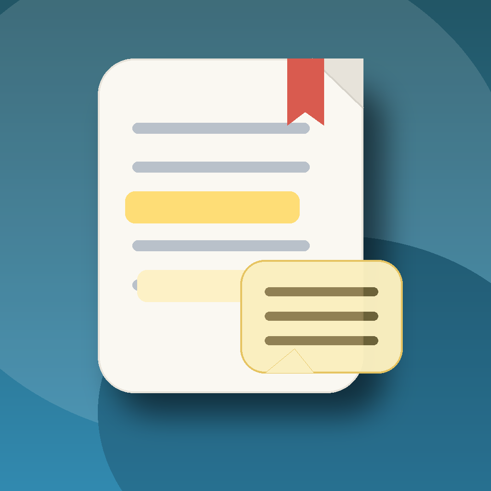

<div align="center">



# English Paper Reader

**A native macOS app for reading English research papers while building your vocabulary**

[](https://swift.org)
[](https://developer.apple.com/macos/)
[](#)
[](https://github.com/mksmkss/English-Paper/releases)

**English** | [日本語](./README.md)

</div>

---

## What It Does

English Paper Reader is a macOS app that lets you read English paper PDFs, register unfamiliar words on the spot, and review their meanings, examples, and appearances later.

- Quickly register words while reading a PDF
- Highlight registered words directly in the PDF
- Show meanings and examples on hover
- Organize PDFs in folders
- Search the word list by definition
- Jump back to the exact appearance in the paper
- Sync vocabulary data only through GitHub

---

## Download

### Install with a one-liner

```bash
curl -fsSL https://raw.githubusercontent.com/mksmkss/English-Paper/main/install.sh | sh
```

This script will:

- Download the latest `PapersApp-macOS.zip` release
- Install `PapersApp.app` into `/Applications`
- Set `~/Documents/EnglishPaperReader Library` as the default library folder

### Manual download

```bash
curl -fL https://github.com/mksmkss/English-Paper/releases/latest/download/PapersApp-macOS.zip -o PapersApp-macOS.zip
```

Then unzip it and move `PapersApp.app` into `/Applications`.

> [!NOTE]
> `releases/latest/download/...` becomes available after at least one GitHub Release has been published.

---

## Main Features

| Feature | Description |
|------|------|
| 📄 **PDF Reading** | Read research paper PDFs while learning vocabulary in context |
| ✍️ **Quick Register** | Select a word and save its meaning immediately |
| 💡 **Hover Preview** | Pause the cursor on a registered word to see its meaning and example |
| 🟨 **Highlighting** | Show registered appearances directly in the PDF |
| 🗂 **Folder Organization** | Create folders, rename them, nest them, and move PDFs by drag and drop |
| 🔎 **Word Search** | Search registered words by definition as well as surface form |
| 🔗 **Appearance Jump** | Jump from a word entry back to where it appeared in the paper |
| ☁️ **Data-only GitHub Sync** | Sync only `.paperapp/backup.sql` to GitHub |

---

## About GitHub Sync

GitHub sync in this app is designed for **vocabulary data only**, not your source code.

What gets synced:

- words
- meanings
- examples
- appearances
- folder structure
- PDF-to-folder assignments

What does not get synced:

- PDF files themselves
- the app source code

Vocabulary data is stored in `.paperapp/backup.sql` inside your library folder, and only that file is pushed to GitHub.

> [!IMPORTANT]
> On another Mac, PDF absolute paths may differ, so some PDFs may need to be relinked after syncing.

---

## How to Use It

### 1. Add a PDF

Use the `Add PDF` button at the top of the left sidebar to import a paper PDF.

### 2. Register a word

Select a word or short phrase in the PDF to open `Quick Register`.

- Enter a definition
- Optionally add `Pronunciation or kana`
- Save it to highlight the word in the PDF

### 3. Review later

- Use the word list at the bottom to review saved words
- Edit meanings, examples, and appearances in the right inspector
- Click an appearance to jump back into the paper

### 4. Sync to GitHub

Use the GitHub icon in the top-right toolbar to connect a repository for vocabulary data sync.

---

## Storage Location

Your data is stored inside the library folder:

```text
~/Documents/EnglishPaperReader Library/
└── .paperapp/
    ├── app.db
    └── backup.sql
```

This keeps reading data separate from your development repository.

---

## Build and Run

### Development

```bash
swift build
swift run EnglishPaperReader
```

### Build the app bundle

```bash
./App/build-app.sh
open /Users/masataka/Coding/Swift/english-paper-reader/.build-release/PapersApp.app
```

### Package for distribution

```bash
./App/package-release.sh
```

Generated files:

- `dist/PapersApp-macOS.zip`
- `dist/PapersApp.dmg`

---

## Releasing

The GitHub Actions release workflow does not run on a normal push. It runs on a **`v*` tag push** or **manual dispatch**.

Example:

```bash
git tag v0.1.0
git push origin v0.1.0
```

That will trigger Actions and publish the release assets.

---

## Project Structure

```text
English-Paper/
├── Sources/EnglishPaperReader/
│   ├── App/                    # SwiftUI screens and UI logic
│   ├── Database/               # SQLite bootstrap and migration
│   ├── Models/                 # Data models
│   ├── Repositories/           # Database access layer
│   ├── Support/                # Paths, git sync, backup export, etc.
│   └── Utilities/              # PDF helpers and supporting utilities
├── Tests/EnglishPaperReaderTests/
├── App/                        # App bundle and release packaging scripts
├── docs/
└── install.sh
```

---

## Notes

> [!NOTE]
> - `swift build` / `swift test` may depend on the state of your local SwiftPM / Command Line Tools setup.
> - For release validation, the `.app` bundle path via `./App/build-app.sh` is the recommended route.
